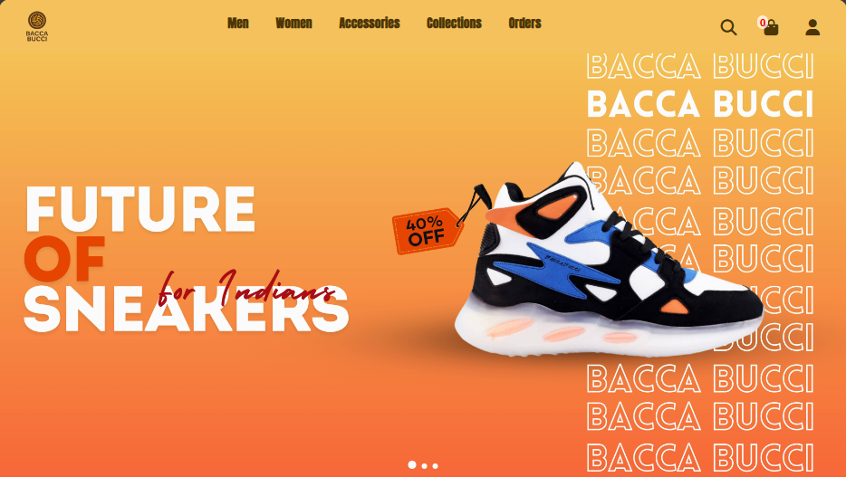
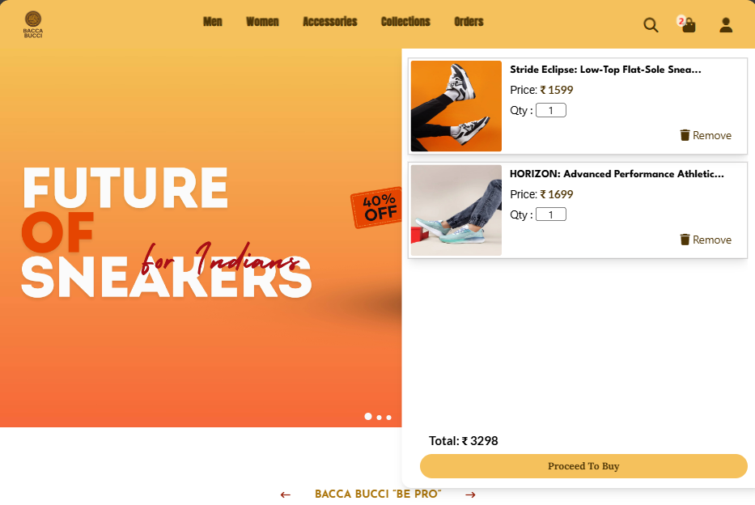
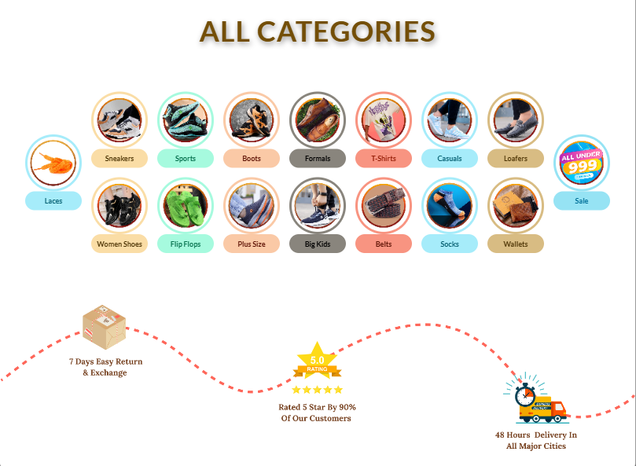
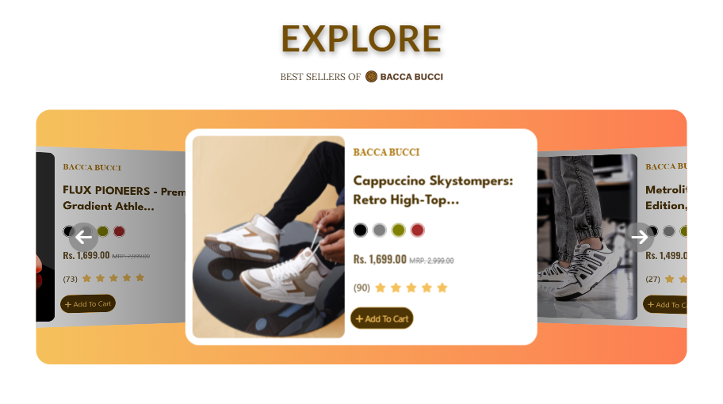
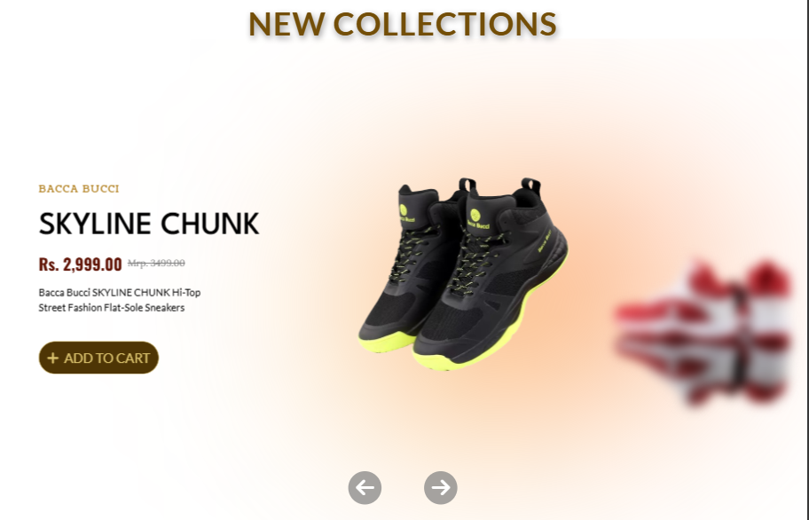
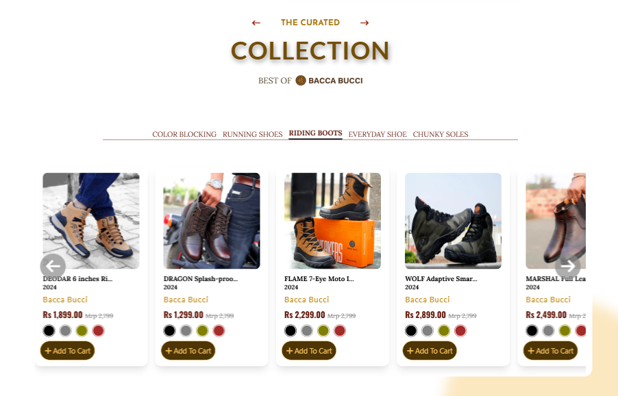
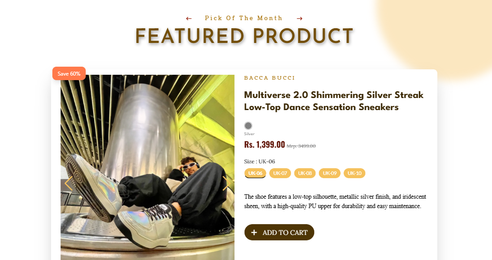
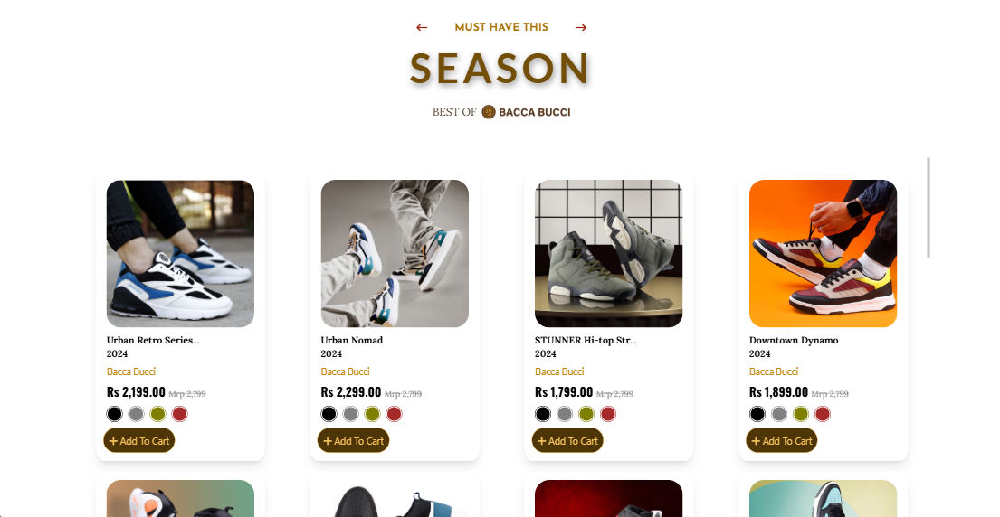
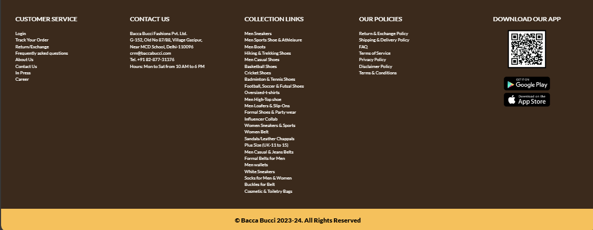

# Reimagine Project - Bacca Bucci Website Recreation & Reimagination

Welcome to our project! This website is a reimagined and recreated version inspired by the Bacca Bucci brand website, which primarily focuses on shoes. Our project is built using HTML, the Tailwind CSS framework, the Swiper JS library, and vanilla JavaScript.

We created this website for the "Re-Imagine Hackathon," a frontend web design competition hosted by Sheryians Coding School. This project was developed for round 1 of the Re-Imagine Hackathon. We are a team of 4 members working on this Project. Our team name is **Ctrl-Plus-Web**.

## Let's Talk About Our Project
<ul>
   <li style="margin-bottom: 40px;">
        <p>Our project includes a homepage with a cart section positioned in the top right corner. We utilize Swiper to implement sliding functionality for the slides.</p>
        
    </li>
    <li style="margin-bottom: 40px;">
        <p>Our project's Add to Cart functionality allows users to add single or multiple pairs of shoes to their cart. The total amount adjusts dynamically as items are added or removed, providing a seamless shopping experience.</p>
        
    </li>
    <li style="margin-bottom: 40px;">
        <p>Explore how we redesign banners to give them a fresh new look. We use Swiper for smooth sliding effects that make them engaging and easy to interact with.</p>
        
    </li>
    <li style="margin-bottom: 40px;">
        <p>Here we recreated the category section where you can find all the category products of Bacca Bucci.</p>
        
    </li>
    <li style="margin-bottom: 40px;">
        <p>This is our Best Sellers section. Here We using Swiper for smooth sliding effects.</p>
        
    </li>
    <li style="margin-bottom: 40px;">
        <p>Discover our new collection carousel showcasing sneakers, belts, t-shirts, and wallets—all in one place for easy navigating.</p>
        
    </li>
    <li style="margin-bottom: 40px;">
        <p>Our curated shoe section where you can find all types of shoes. Use tabs to switch between different styles effortlessly. Here we also using Slider for sliding.</p>
        
    </li>
    <li style="margin-bottom: 40px;">
        <p>This is the month's featured item. Here we Using Slider for shoe image sliding.</p>
        
    </li>
    <li style="margin-bottom: 40px;">
        <p>This is the Season Product section.</p>
        
    </li>
    <li style="margin-bottom: 40px;">
        <p>At last but not the least this is our footer section.</p>
        
        
    </li>
</ul>


## Installation

Install with npm

```bash
npm i
```

## To Run the Project after cloning

Run server with npm

```bash
npm run start
```

## API Reference

#### Get all items

```http
    https://github.com/JayaSaha811733/ReimagineAPI/assets.json
```

## Authors

- [@Jayashree Saha](https://github.com/JayaSaha811733)
- [@Angshu Das](https://github.com/Angshu09)
- [@Debojeet Dutta](https://github.com/BinaryDebojeet)
- [@Sumit Dutta](https://github.com/Sumit02635)

## Acknowledgements

- [JavaScript reference](https://www.w3schools.com)
- [Tailwind docs](https://tailwindcss.com/docs/installation)
- [Swiper JS demo ](https://swiperjs.com/demos)
